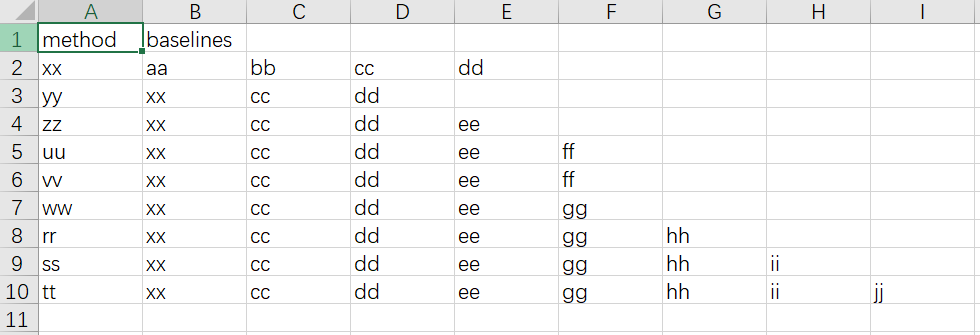
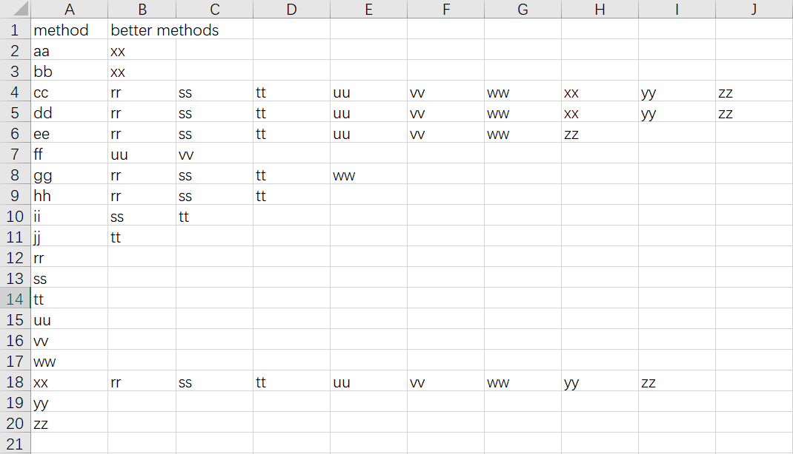

# Method-Evolution-Tracker

A tool to track and analyze the evolution of research methods based on paper comparisons.


## Overview

To run the method evolution tracker, execute the following command:

```bash
python run_tracker.py
```

### Input Format



The input consists of a set of comparisons from research papers. Each comparison indicates which method outperforms others in a given paper. For example:

- In paper **xx**, method **xx** is better than methods **aa**, **bb**, **cc**, **dd**.
- In paper **yy**, method **yy** outperforms **xx**, **cc**, and **dd**.

### Output Format


The output generates a summary of the evolution of methods over time. For example,
- after method **xx** is proposed, subsequent methods like **rr**, **ss**, **tt**, **uu**, **vv** are considered superior. The tool helps track the progression of method **xx** over time.


## Environment

- **Python**: 3.10
- **Pandas**: 2.0.3

## Installation

1. Clone this repository:
   ```bash
   git clone https://github.com/yourusername/method-evolution-tracker.git
   ```
   
2. Install dependencies:
   ```bash
   pip install -r requirements.txt
   ```

## Parameters

- `--verbose`: Enable detailed process information during execution. This can help debug or understand the underlying analysis steps.
  
  Example:
  ```bash
  python run_tracker.py --verbose
  ```

- `--transitive`: Whether to compute transitive closure. For example, if **xx** is better than **yy**, and **yy** is better than **zz**, this flag will consider **xx** as better than **zz** as well. By default, this is set to `False`, which means only the direct comparisons stated in the papers are considered.
  
  Example:
  ```bash
  python run_tracker.py --transitive
  ```


## Contributing

Feel free to fork this repository, contribute bug fixes, or propose new features via pull requests. Contributions are welcome!

## License

This project is licensed under the MIT License - see the [LICENSE](LICENSE) file for details.